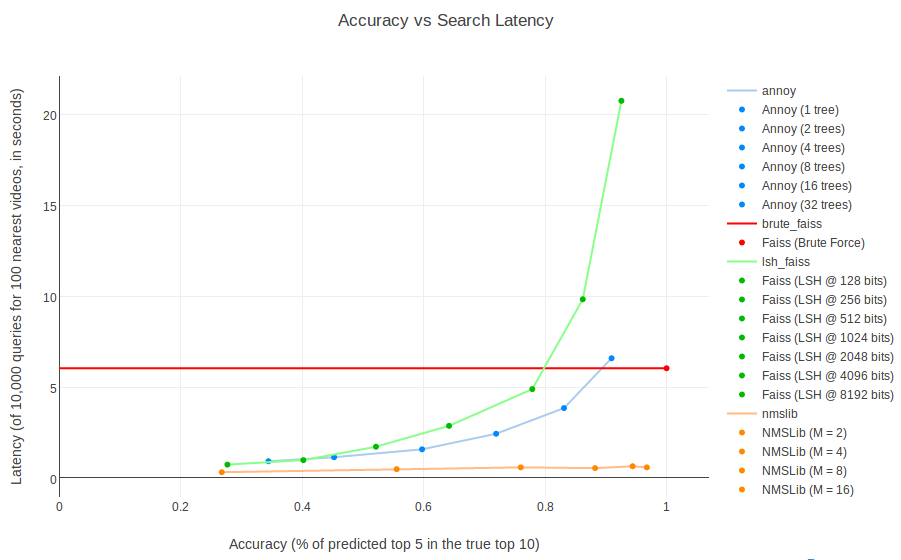
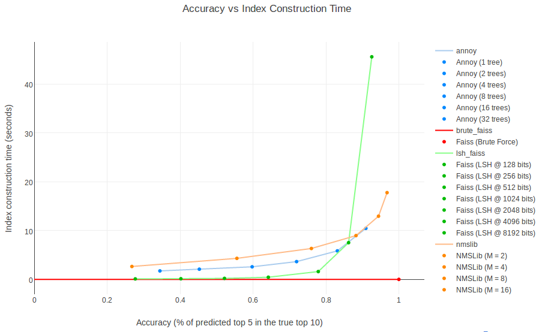

# space_bench

Want to use a spatial index ("space") of high-dimensional embeddings in python?

This repo benchmarks latency, accuracy, and index construction time for different libraries (currently [annoy](https://github.com/spotify/annoy), [faiss](https://github.com/facebookresearch/faiss), [nmslib](https://github.com/searchivarius/nmslib)).

